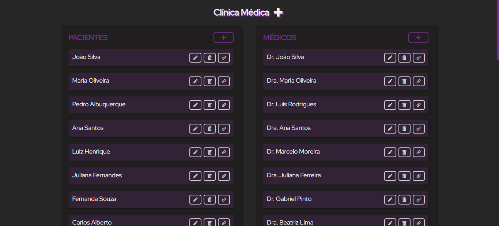
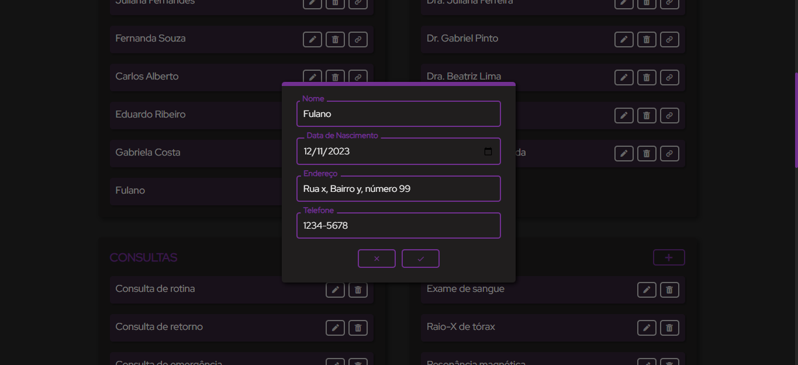
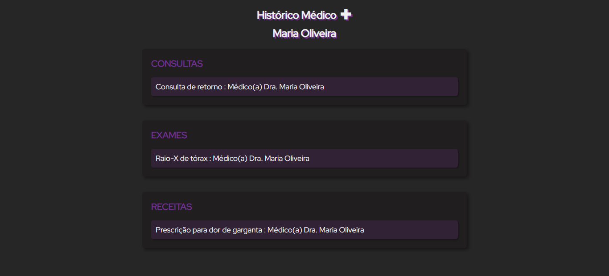
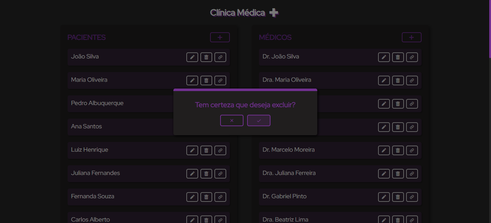

# Projeto Clínica Médica

Projeto desenvolvido na disciplina de Banco de Dados, na Universidade Federal de Alfenas - UNIFAL

Esse projeto representa um sistema de banco de dados de uma clínica médica fictícia, que é gerenciado por uma aplicação web utilizado Spring Boot que faz integração com o banco de dados.

## Requisitos para testar

- Java 17
- Spring Boot 3
- MySQL

Antes de começar você deve modificar o usuário e senha do mysql no arquivo application.properties na pasta resources e criar um banco de dados "trabalhoBD".

Para criar e popular as tabelas você pode utilizar os scripts .SQL na pasta scriptsLinux dentro do projeto.

## Participantes

- [Gabriel Francelino](https://github.com/gabriel-francelino)
- [Gabriel Piva](https://www.github.com/gpiiva)
- [Lucas Lima](https://www.github.com/LucasclFerreira)
- [Gustavo Fidelis](https://www.github.com/GustavoFidelisCamilo)
- [Brandon Afonso](https://www.github.com)

## Projeto

### Início

### Editar/Cadastrar

### Informações específicas

### Remover

